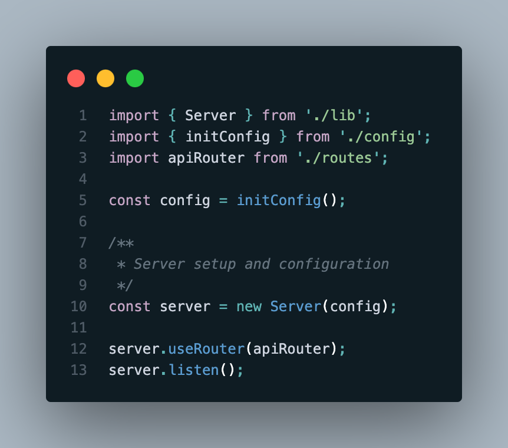
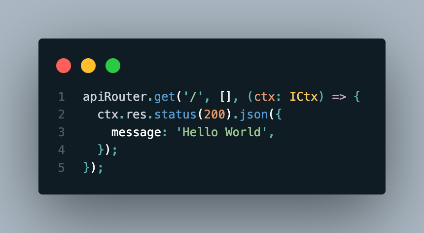
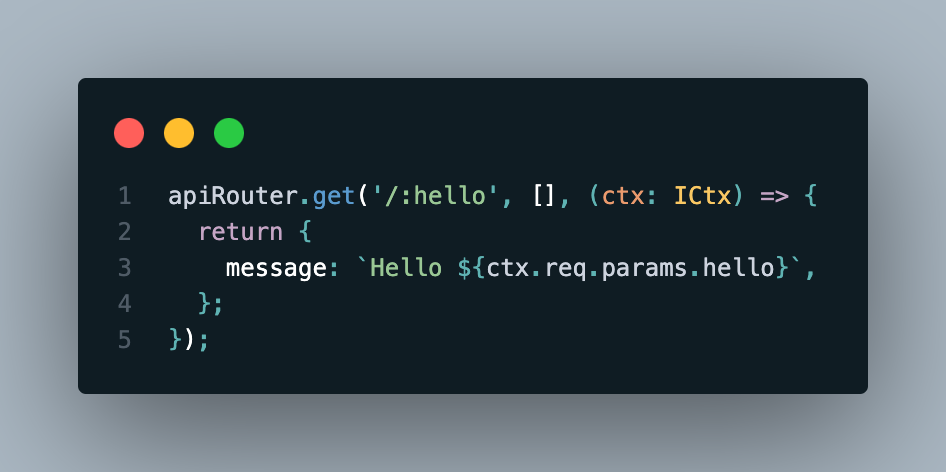
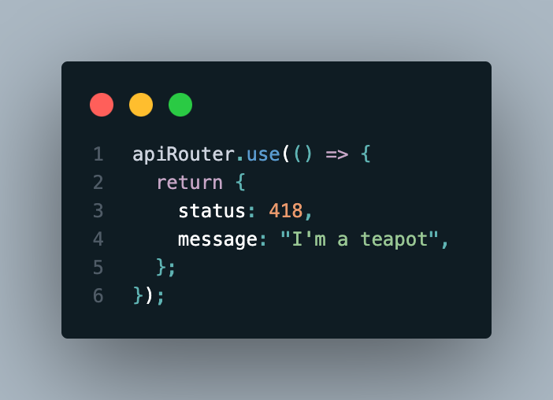
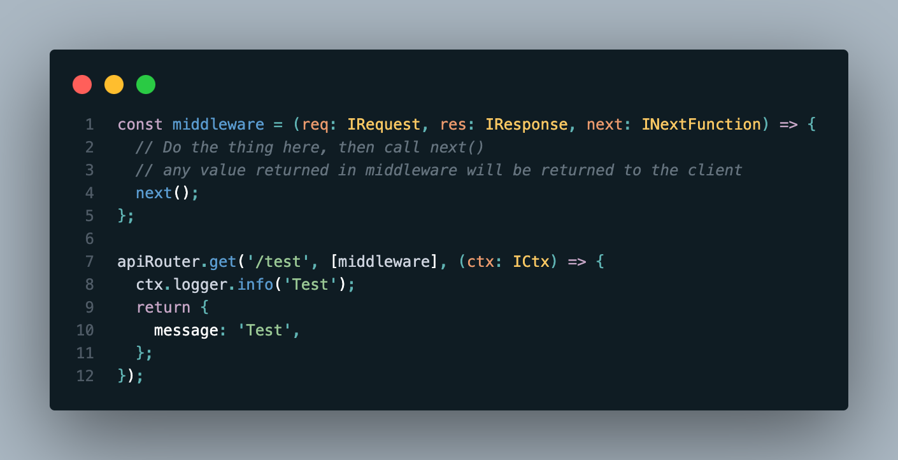
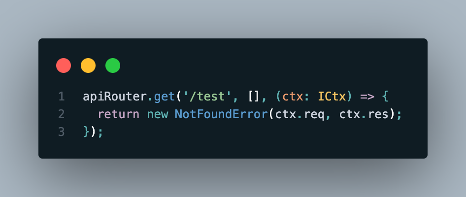
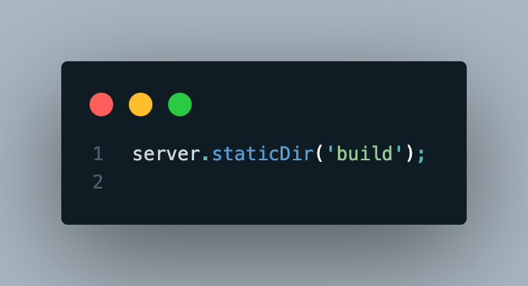
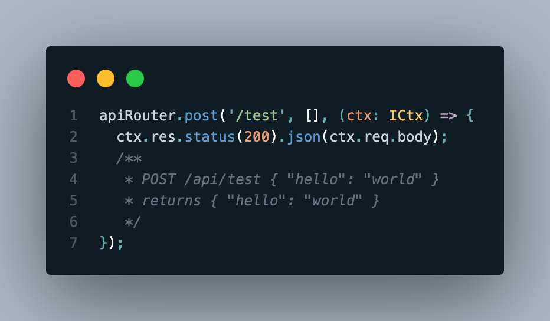
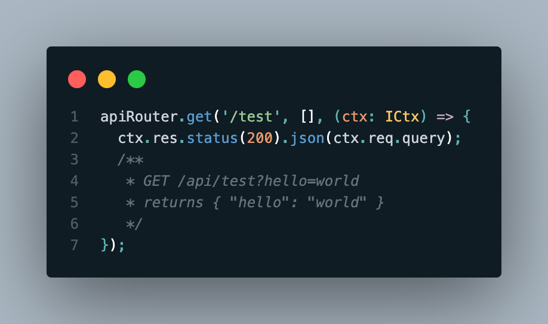

# NODER.JS

## What is Noder.js?
Noder.js is what I'm calling this github repo, you can call it whatever you'd like. This is a bit of a wrapper around a basic Node.js HTTP server. It works very similarly to Express.js but is much more lightweight. There are way to many to check, but so far it's worked with every Express middleware I've tried. It's also very easy to add your own middleware in the same style that Express.js uses.

***I would not recommend using this in production, it's just a fun little project I've been working on.*** Feel free to open PR's or use this project in any way that you see fit.

## Highlights

- Simple and easy to use
  - Works essentially the same as Express.js
- Lightweight
  - Only 2 dependencies
    - pino for logging
    - uuid for generating unique ids for each request
- Works with **MOST** Express.js middleware
  - I've tested it with a few different middleware, though I can't guarantee it will work with all of them
- Easy to add your own middleware
- FAST

## Features
- Basic HTTP server
  - Handles OPTIONS, GET, POST, PUT, PATCH, DELETE
  - 
- Basic routing
  - In the same style as Express.js
  - 
- One param per route
  - This could be expanded but is a personal preference to avoid complex routes
  - 
- Middleware
  - Works with most Express.js middleware, though I can't guarantee it will work with all of them. Middleware at the server level takes the http incoming message and server respone but at the router or route level it uses the extended types. Returning from middleware will short circuit the rest of the middleware and the route.
  - 
- Logging
  - Uses pino for logging
  - 
- Error handling
  - The framework should catch all errors and log them, but you can also add your own error handling inside the callbacks or middleware.
  - 
- Static file serving
  - Uses 'public' dir by default but can be set to any dir inside the 'app' dir.
  - 
- Basic body parsing
  - Supports JSON
  - 
- Basic query string parsing
  - Parses query strings into an object
  - 

## How to use
However you'd like. The infrastructure is there to use it in a similar fashion to how I would. There are a few basic example routes inside the routes/index.ts. Feel free to reach out with any questions.

### Basic / Development
1. Clone the repo
2. Run `npm install`
3. Run `npm run dev`

### Production **(Not recommended)**
1. Clone the repo
2. Run `npm install`
3. Run `npm run build`
4. Run `npm run start`
- There is also a dockerfile included if you prefer containerization
  - docker-compose up --build -d

## TODO
- [ ] Add more tests
- [ ] Add more documentation
- [ ] Test with more databases
- [ ] Test with more Express middlewares
